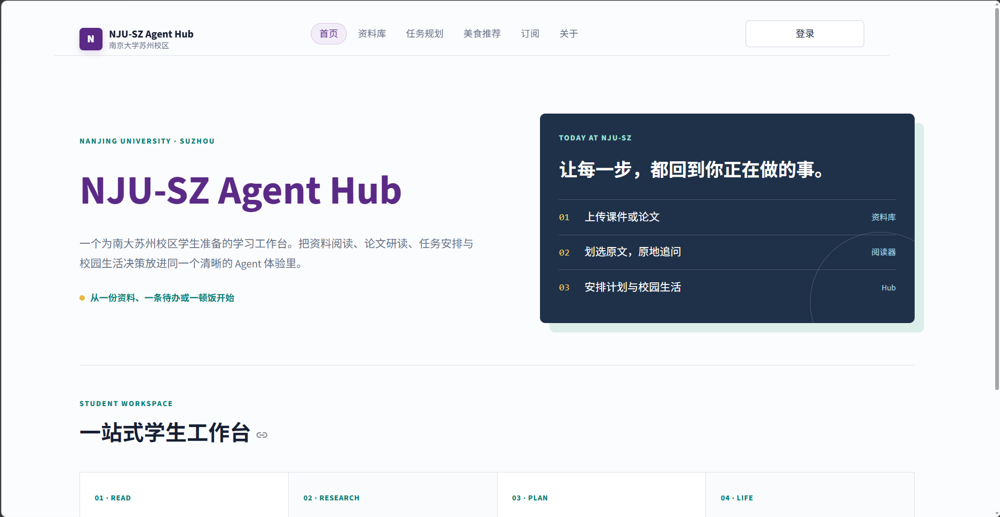
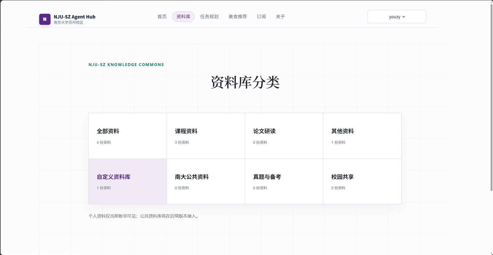
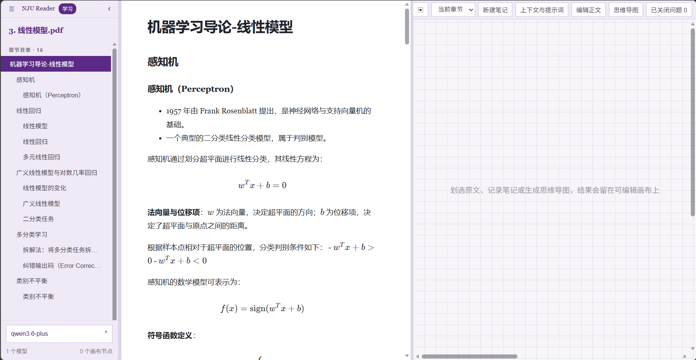
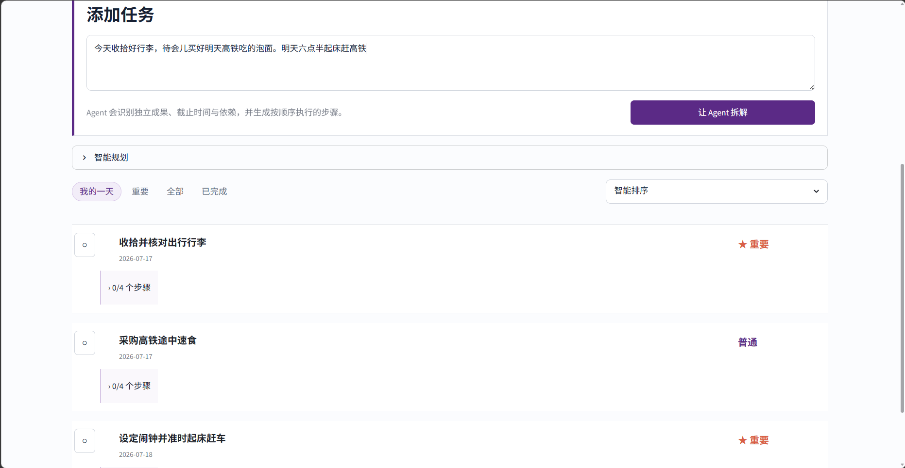
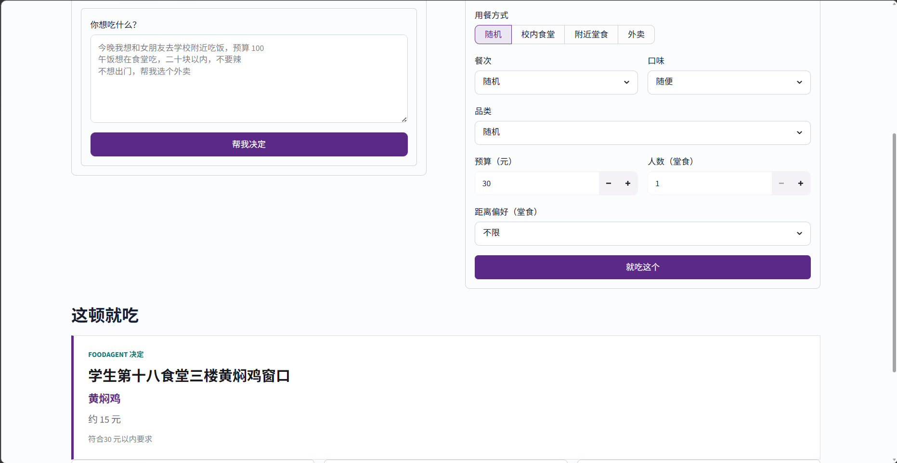

# NJU-SZ Agent Hub

这是一个面向南京大学苏州校区学生的校园 Agent 工作台。

平台把课程资料、论文阅读、任务安排和“今天吃什么”放在同一个空间里：资料先被整理成可阅读、可检索的正文，问题再由对应的 Agent 调用工具完成。模型负责理解和组织，Python 负责检索、权限、数据筛选与随机选择，结果也因此更容易追溯。

> NJU-SZ Agent Hub 是一个面向学生真实场景的多功能 Agent 平台。系统围绕课程学习、科研阅读、时间管理和饮食决策四类高频需求，结合 RAG、工具调用、分层记忆、动态思维树和多模型统一接口，构建一个可扩展的校园个人 AI 助手原型。

 

## 平台功能

- **把资料变成阅读空间**：上传 PDF、PPTX、TXT 或 Markdown，自动提取正文、识别章节、清理重复内容并建立检索索引。
- **在原文旁边学习**：划选一段话后，可以解释、追问、举例、解题、记录笔记或生成思维导图；回答以可移动、可缩放的节点留在画布上。
- **辅助论文研读**：围绕研究问题、方法、创新点、实验设置、局限、组会汇报和复现清单组织阅读任务。
- **把一句待办拆成行动**：Todo Agent 识别独立成果、截止时间、优先级和依赖，并生成有顺序的子任务；周计划会比较多个候选方案。
- **替选择困难做决定**：FoodAgent 理解自然语言或表单限制，再由 Python 从审核过的本地数据中严格筛选并随机选出一个结果。
- **使用自己的模型**：每个账号可以保存、测试、切换和删除自己的 Qwen、Kimi、DeepSeek、智谱或其他 OpenAI-compatible API 配置。

## 一般使用路径

1. 注册并登录，在“订阅”页添加自己的模型 API，先测试连接，再保存为当前模型。
2. 进入“资料库”，上传一份课件、教材或论文。
3. DocumentProcessingAgent 提取文字、判断文档类型、恢复章节和公式，必要时执行本地 OCR。
4. 打开学习画布，沿左侧目录阅读；划选正文后原地提问，或把回答、笔记和思维导图留在右侧画布。
5. 把复习目标交给 Todo Agent 安排，吃饭时再让 FoodAgent 从本地审核数据中替你做一个明确决定。

 

 

## 系统结构

```text
┌──────────────────────── Streamlit UI ────────────────────────┐
│ 首页  资料库/阅读画布  任务规划  美食推荐  订阅与模型  关于 │
└────────────────────────────┬──────────────────────────────────┘
                             │
┌──────────────────────── Agent Layer ─────────────────────────┐
│ DocumentProcessingAgent   ReadingAgent   PaperResearchAgent  │
│ TodoPlanningAgent         FoodAgent      ToolUsingAgent      │
└───────────────┬──────────────────┬──────────────────┬─────────┘
                │                  │                  │
       ┌────────▼────────┐ ┌───────▼────────┐ ┌──────▼─────────┐
       │ RAG & Documents │ │ Memory         │ │ Domain Tools   │
       │ parse / OCR     │ │ working        │ │ todo / food    │
       │ clean / assets  │ │ user preference│ │ web evidence   │
       │ chunks / TF-IDF │ │ knowledge      │ │ thought tree   │
       └────────┬────────┘ └───────┬────────┘ └──────┬─────────┘
                └──────────────────┼──────────────────┘
                                   │
                         ┌─────────▼─────────┐
                         │ LLM Gateway       │
                         │ OpenAI-compatible │
                         └─────────┬─────────┘
                                   │
                    ┌──────────────▼──────────────┐
                    │ SQLite + local file storage │
                    └─────────────────────────────┘
```

## 资料库与阅读画布

资料库是当前学习与研究流程的主入口，把“文件”变成可以继续加工的学习资料。

### 文档处理流水线

DocumentProcessingAgent 会按文档特征选择处理策略：

1. **提取正文**：PyMuPDF 读取 PDF，python-pptx 读取 PPTX，TXT 与 Markdown 直接解析。
2. **处理扫描页**：少量稀疏页可交给支持视觉输入的模型；扫描页较多时使用 RapidOCR，避免逐页调用模型。
3. **识别页面角色**：区分正文、目录/提纲和应跳过的页面，过滤封面、出版信息、致谢、结束语等非学习内容。
4. **恢复章节**：优先使用 PDF 书签，其次识别正文主标题，最后才由模型规划章节。
5. **重建 Markdown**：保留定义、推导、公式、表格、例题和实验内容，统一数学公式定界符。
6. **去重与质检**：清理重复页眉页脚、重复段落和无效结束页；对明确检测到的问题进行定向返修。
7. **绑定图片**：提取 PDF 图片，只把正文明确保留的图像标记绑定回文档，避免把装饰图和重复幻灯片全部塞进阅读器。
8. **建立索引**：按块写入 SQLite，问答时通过 TF-IDF 检索相关片段。

长文档处理会在上传文件旁保存缓存。每个章节还会拆成约 4.5k 字符的连续分片，模型结果通过 SSE 流式接收，并在分片成功后立即原子写入断点；Agent 会根据分片长度和本章分片数量分配 4–6 次调用级重试机会。构建和重新整理都会进入 SQLite 持久任务队列，临时断连后按 5 秒至 5 分钟的指数退避自动续跑，服务意外重启后也会根据任务心跳恢复。用户可以关闭构建窗口或切换到其他功能；同一文档只允许一个活动任务，已经完成的 OCR、结构规划、章节分片和整章结果不会重做。密钥无效、模型不存在等不可恢复错误会暂停任务并等待用户处理；一份没有错误的已完成资料主动点击“重新整理”时，才会从原文件完整重建。

### 阅读画布功能简介

- 左侧章节目录与正文区域可以调整宽度。
- 正文支持 Markdown、表格、代码块与 KaTeX 数学公式。
- 划选文字后可执行解释、变量含义、为什么、举例、解题、自定义提问、笔记、重点标记和选区思维导图。
- 上下文可以选择当前选区、段落、章节、整篇文档或 RAG 相关片段。
- AI 回答、笔记与思维导图会成为画布节点，可拖动、缩放、编辑、关闭、恢复或永久删除。
- 对已有回答继续追问时，父回答会折叠，避免画布无限拉长。
- 标记、问题和节点位置都会保存，下次打开仍能继续。
- 自定义资料可以由拥有者编辑正文；共享分类中的全局资料由管理员维护。

## RAG：回到资料本身

文档完成处理后会被切成带重叠的文本块，保存到 `document_chunks`。检索时使用 `TfidfVectorizer` 计算查询与文本块的相似度，取最相关片段作为上下文。

```text
上传文件
  → 文本/OCR 提取
  → 结构化 Markdown
  → 文本切块
  → SQLite 中的知识块
  → TF-IDF 检索 Top-K
  → 连同问题交给 ReadingAgent / Course Agent / Paper Agent
```

这个实现有意保持轻量：clone 后不需要单独启动向量数据库。`src/rag/simple_vector_store.py` 已经把数据访问与排序接口分开，后续可以把内部实现替换为 FAISS、Chroma 或服务端向量库。

## 三层记忆

项目利用三层记忆，防止把整段聊天历史无差别地塞给模型，而是按用途分层：

| 层级             | 保存什么                                 | 当前用途                                           |
| ---------------- | ---------------------------------------- | -------------------------------------------------- |
| Working Memory   | 当前任务、文档、最近输入和最近输出       | 保持一次页面会话中的连续状态                       |
| User Memory      | 饮食忌口、口味、预算、学习时间与规划偏好 | FoodAgent 和 Todo Agent 在执行前按查询检索相关偏好 |
| Knowledge Memory | 用户上传资料及其文本块                   | RAG 检索、章节问答和论文分析                       |

长期记忆使用关键词相关性、重要度和时间新鲜度排序；同类饮食偏好会更新而不是无休止追加。它目前主要服务饮食和规划场景，未来可以继续接入阅读讲解风格、常用课程、研究兴趣和跨资料学习记录。

## Todo Agent 与 Dynamic Thought Tree

TodoPlanningAgent 会先读取未完成任务和用户规划偏好，再将自然语言拆成独立成果。写入数据库前还会做一次确定性校验：空标题、无效优先级和重复任务不会直接入库，缺少子任务时会补成“准备、执行、检查”的基本闭环。

任务列表支持智能排序、截止日期、优先级、创建时间和完成时间排序。默认智能排序首先考虑是否完成和截止日期，再考虑优先级。

生成本周计划时会调用轻量 Dynamic Thought Tree：

1. 生成三个策略不同的候选计划；
2. 按时间结构、优先级、子任务和复盘节点评分；
3. 选择得分最高的方案；
4. 由 Todo Agent 整理成最终周计划，而不是把三个冗长候选全部丢给用户。

 

## FoodAgent：模型理解需求，Python 做决定

自然语言输入会先判断用户想在食堂吃、附近堂食还是点外卖，并提取预算、餐次、口味、品类、人数和距离等限制。真正的推荐对象只能由以下 Python 工具从审核数据中选出：

- `choose_canteen_food`
- `choose_nearby_restaurant`
- `choose_takeaway`

工具会严格过滤停用记录、会话排除项、预算、餐次、忌口、人数和距离，再根据口味、品类与长期偏好做加权随机。“换一个”会在当前会话排除上一次结果，因此不会立即重复。

正式数据保存在 [data/campus_foods.json](data/campus_foods.json)，结构分为：

```json
{
  "schema_version": 2,
  "campus": "南京大学苏州校区",
  "canteen_dishes": [],
  "restaurants": [],
  "takeaways": [],
  "pending_review": [],
  "sources": []
}
```

仓库当前包含人工维护的食堂菜品和附近餐厅数据。联网更新只会把公开搜索线索放进 `pending_review`，不会直接进入正式推荐池；管理员审核后才能启用。这样既允许数据持续更新，也不会让一段不可靠的搜索摘要直接变成“今日推荐”。

手动刷新线索：

```bash
python scripts/update_food_data.py --username admin --force
```

 

## 模型配置

所有服务商统一走 OpenAI-compatible Chat Completions：

```text
POST {API Base}/chat/completions
```

已内置 Qwen、Kimi、DeepSeek、智谱、OpenAI-compatible 和 Custom 的配置入口。填写 API Base、API Key 和模型名称后，必须先通过真实连接测试才能保存。网路连接或限流类错误会进行有限重试；配置错误不会盲目重试。

`API Base` 通常填到版本路径，例如 `https://api.example.com/v1`；若填入了完整的 `/chat/completions` 路径，Gateway 也会在保存时自动规范化。

> API Key 当前明文保存在本机 SQLite。这适合本地课程演示，不适合直接部署到公开服务器；正式部署应使用密钥管理服务或至少进行应用层加密。

## 账号、个人资料与共享资料

- 普通用户拥有自己的模型、资料、任务、记忆和阅读画布数据。
- 普通用户可以在各资料分类中添加个人资料，这些修改只属于该账号。
- 管理员添加到非自定义分类的全局资料会对所有账号可见。
- 自定义资料正文可由拥有者编辑；全局共享资料只允许管理员编辑。
- 管理员可以注销普通账号，并清理该账号的资料、模型、待办、记忆、画布数据和上传文件。

首次初始化会根据环境变量创建本地管理员。`.env.example` 中的 `admin / 123456` 只是开发默认值，实际使用前请务必修改。

## 快速开始

需要 Python 3.10 或更高版本。

### 1. 安装依赖

```bash
pip install -r requirements.txt
```

### 2. 配置环境变量

复制 `.env.example` 为 `.env`，再按本机环境修改：

```env
APP_NAME=NJU-SZ Agent Hub
DATABASE_URL=sqlite:///storage/app.db
USE_SYSTEM_PROXY=false
DEFAULT_ADMIN_USERNAME=admin
DEFAULT_ADMIN_PASSWORD=请换成新的本地密码
```

每个用户的当前模型保存在数据库中，因此正常使用不需要填写预留的 `DEFAULT_PROVIDER` 和 `DEFAULT_MODEL`。`USE_SYSTEM_PROXY=false` 表示模型请求不读取系统代理环境变量；必须通过系统代理访问 API 时再改为 `true`。

### 3. 初始化并启动

```bash
python scripts/init_db.py
streamlit run app.py
```

默认打开 [http://localhost:8501](http://localhost:8501)。首次使用先登录，再到“订阅”页配置模型。

如果 8501 已被旧进程占用，可以指定新端口：

```bash
streamlit run app.py --server.port 8502
```

## 常用维护命令

```bash
# 初始化或迁移数据库
python scripts/init_db.py

# 运行不调用真实模型的核心烟雾测试
python scripts/smoke_test.py

# 运行单元测试
python -m unittest discover -s tests -v

# 强制刷新饮食公开线索，只写入待审核区
python scripts/update_food_data.py --username admin --force

# 重新处理资料库中的文档
python scripts/reprocess_library.py --help

# 评估某份文档处理结果中的重复块等指标
python scripts/evaluate_document_agent.py --help

# 清理指定普通账号的个人内容
python scripts/reset_user_content.py --help
```

文档处理与真实模型有关，因此相关脚本可能产生 API 调用和费用。单元测试会使用临时数据与替身，不要求联网。

## 数据存放位置

```text
storage/app.db                 SQLite 主数据库
storage/uploads/<user_id>/    用户上传的原文件
storage/document_assets/      从文档提取并绑定的图片
data/campus_foods.json        审核后的饮食数据与待审核线索
data/campus_food_update_meta.json  饮食刷新状态
```

上传文件和数据库默认不提交到 Git。删除或移动 `storage` 前请先自行备份需要保留的个人资料。

## 数据库概览

| 表                                  | 作用                                |
| ----------------------------------- | ----------------------------------- |
| `users`                           | 本地账号与管理员标记                |
| `user_model_configs`              | 用户模型配置与当前模型              |
| `documents` / `document_chunks` | 文档元数据、结构化正文和 RAG 文本块 |
| `library_folders`                 | 用户资料文件夹                      |
| `document_questions`              | AI 回答、笔记、追问关系与画布位置   |
| `document_mindmaps`               | 思维导图与画布位置                  |
| `document_highlights`             | 可恢复的精确原文标记                |
| `todos` / `todo_subtasks`       | 父任务和有顺序的执行步骤            |
| `memory_items`                    | 长期用户偏好与重要度                |
| `agent_runs`                      | Agent 计划、工具轨迹和最终结果      |

`init_db()` 会在启动时创建缺失表，并为早期数据库补齐新字段，因此正常升级不需要手写迁移 SQL。

## 项目目录

```text
nju-sz-agent-hub/
├── app.py                       # Streamlit 入口与导航
├── data/                        # 校园饮食数据与示例资料
├── storage/                     # 本地数据库、上传文件和文档图片
├── scripts/                     # 初始化、评估、导入和维护脚本
├── tests/                       # 文档、图片、FoodAgent、记忆、账号和 Gateway 测试
└── src/
    ├── agent/                   # Agent runtime 与领域 Agent
    ├── auth/                    # 注册、登录、模型与账号管理
    ├── llm/                     # OpenAI-compatible Gateway
    ├── memory/                  # Working / User Memory
    ├── modules/                 # 面向 UI 的业务调用接口
    ├── rag/                     # 解析、OCR、图片、切块和 TF-IDF 检索
    ├── ui/                      # Streamlit 页面与阅读画布组件
    └── utils/                   # 文件与 Markdown 工具
```

## 当前边界

项目已经可以完成端到端演示，但仍保留一些有意为之的本地原型边界：

- SQLite 与本地文件存储适合单机体验，还不适合多实例并发部署。
- OCR、章节恢复和图片保留质量会不可避免地受原文件排版与所选模型影响，正文编辑功能用于让用户修正结果。
- “平台订阅”是产品形态展示，没有支付、订单或真实额度系统。
- 当前服务面向可信本地环境，正式公网部署还需要 CSRF、速率限制、密钥管理、审计和更完整的权限服务。

## 关于这个项目

NJU-SZ Agent Hub 起点是一份课程项目，但本人很希望把他做成一个长期可以上线的平台。当同学们面对一份长课件、一篇论文、挤在一起的截止日期，或者一顿迟迟决定不了的晚饭时，希望这个 Agent 能不能把资料、上下文和工具组织成真正有用的下一步。

这也是本项目继续演进的方向：少一点无依据的万能回答，多一点能被看见、检查和继续编辑的过程。
